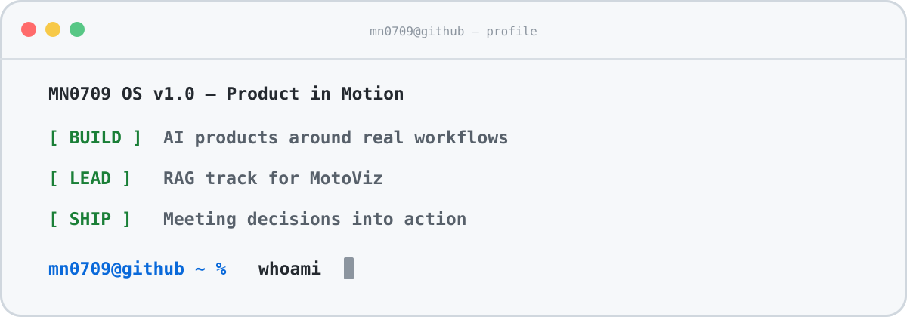

# Hi, I'm 曼宁 👋

**AI Product Builder · Product Manager · Focused on Agent Workflows & AI Products**

我在做能真正进入工作流的 AI 产品：把会议内容转成可追溯的决策与行动，把摩托车改装知识转成可检索、可引用的 RAG 能力。

---

## Featured projects

### 🎙️ meeting-review

面向固定团队的会议决策与行动复盘工具。支持带时间戳转写、决策原话引用、结构化行动项和团队隔离的历史记录；原始音频在处理完成或失败后删除。

`Private project` · FastAPI · SQLite · faster-whisper · LLM workflow

### 🏍️ [MotoViz](https://github.com/MN0709/MotoViz)

面向摩托车改装店的团队 MVP，通过 3D 改装效果改善销售沟通，并用 RAG 支持配件检索与故障诊断。

**My role:** RAG Lead，负责知识检索方向的任务协调、接口协作与交付验收。

---

## Writing

我关注 AI 产品、Agent 工作流，以及技术变化如何影响产品决策。

- [Skill 会成为 AI 时代的“App Store”吗？从一个开源写作 Skill 的拆解说起](https://mp.weixin.qq.com/s/0q1qbYREkA4SQyrLRZ05Kw)
- [手机涨价 1000 元，AI 产品经理要不要给用户留一条退路](https://mp.weixin.qq.com/s/RsIjyleZqIkPkUU8D_Uhjw)
- [129.3 亿美元，英伟达把“AI 界的 GitHub”买走了](https://mp.weixin.qq.com/s/gTfkKZahSCrVTfAFxS__-Q)

---

## About

- Building AI product MVPs around real workflows
- Exploring Agent workflows, RAG and reusable skills
- Turning product questions into testable prototypes and clearer decisions
- Learning in public through projects and writing

---

## Contact

✉️ [mini.ning9900@gmail.com](mailto:mini.ning9900@gmail.com)

