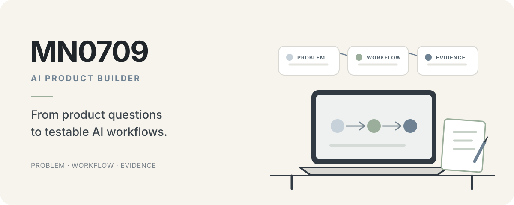

## About me

Building AI products around real workflows.

I turn product questions into testable workflows, focused prototypes, and evidence-backed decisions. My recent work spans meeting intelligence, RAG-powered knowledge retrieval, and reusable agent workflows.

### What I care about

- **Start with the real problem.** Understand the user and the task before choosing a model or tool.
- **Make the workflow testable.** Turn an idea into a focused prototype with clear boundaries.
- **Learn from evidence.** Use real outcomes, feedback, and evaluation to decide what to improve next.

## Selected work

### meeting-review

*Private project*

A meeting review tool for fixed teams that turns timestamped transcripts into traceable decisions and structured action items. Meeting history is isolated by team, while original audio is removed after processing.

### [MotoViz](https://github.com/MN0709/MotoViz)

A team MVP for motorcycle customization shops, combining 3D visualization with RAG-powered parts search and fault diagnosis.

**My role:** RAG Lead, coordinating the knowledge retrieval track, interface collaboration, and delivery acceptance.

## Writing

- [Could Skills Become the App Store of the AI Era?](https://mp.weixin.qq.com/s/0q1qbYREkA4SQyrLRZ05Kw) *(Chinese)* — What changes when workflows and domain methods become reusable modules for AI agents.
- [When Phones Cost ¥1,000 More, Should AI Products Leave Users a Way Out?](https://mp.weixin.qq.com/s/RsIjyleZqIkPkUU8D_Uhjw) *(Chinese)* — A product perspective on rising infrastructure costs, pricing, trust, and graceful downgrade paths.
- [NVIDIA's $12.93 Billion Bet on the “GitHub of AI”](https://mp.weixin.qq.com/s/gTfkKZahSCrVTfAFxS__-Q) *(Chinese)* — What the Hugging Face acquisition could mean for AI infrastructure, dependency risk, and product strategy.

## Find me

[GitHub](https://github.com/MN0709) · [Email](mailto:mini.ning9900@gmail.com)

